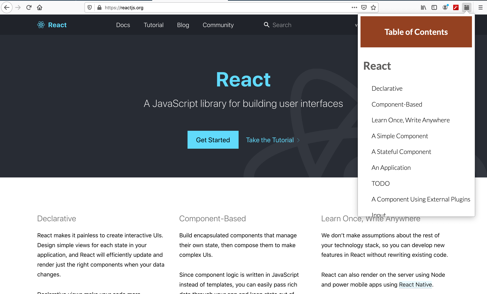

And so it was done,

We had finally built our browser extension and it only took us 2 hours. It took us 2 hours to complete the project but 5 days to submit it – what gives?

The bulk of our time spend on this project arose from typical issues involing collaboration. One the first being deciding what to actually build. 
